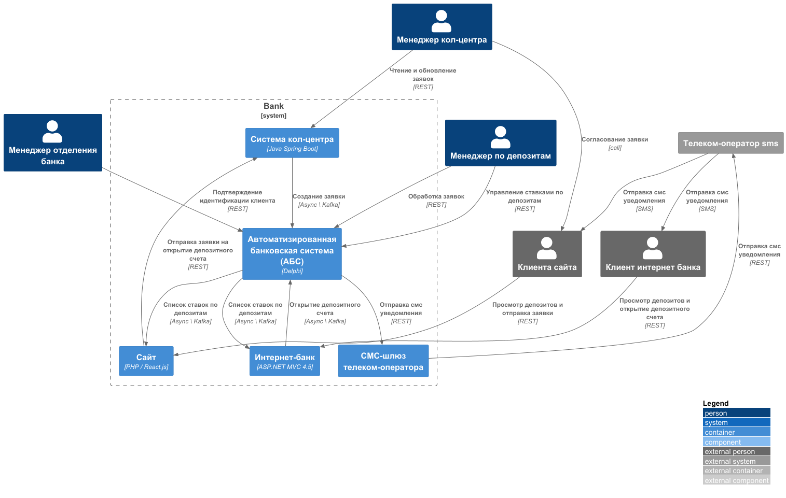
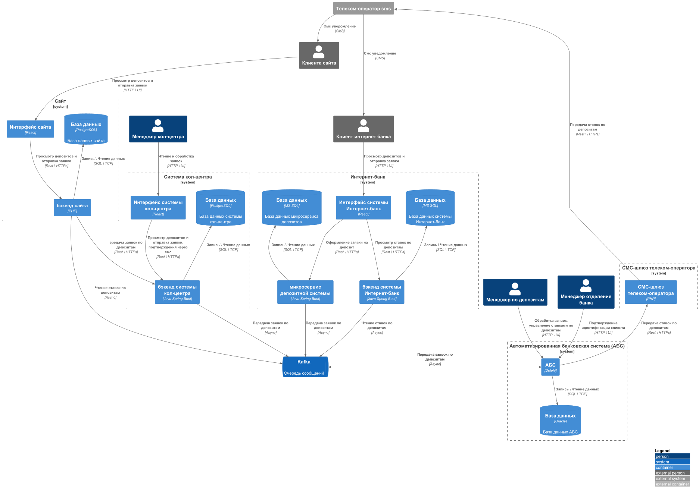

### **Название задачи: MVP по открытию депозитов онлайн **
### **Автор: Лебедев Андрей**
### **Дата: 30 марта 2025г**
### **Функциональные требования**
| **№** | **Действующие лица или системы** | **Use Case**                                                                       | **Описание**                                                                                                                                                                                                                                                             |
|:-----:|:---------------------------------|:-----------------------------------------------------------------------------------|:-------------------------------------------------------------------------------------------------------------------------------------------------------------------------------------------------------------------------------------------------------------------------|
|  UC1  | Клиент интернет банкинга         | список доступных депозитов с актуальными ставками                                  | В интернет-банке клиент видит список доступных депозитов с актуальными ставками и персонализированные ставки лично для него.                                                                                                                                             |
|  UC2  | Клиент сайта                     | онлайн подача заявки на депозит клиентом через сайт                                | На сайте клиент видит список доступных депозитов, по выбранному депозиту отправляет заявку на открытие счета, оставив свой номер телефона и Ф. И. О. После этого ему позвонит менеджер кол-центра. После звонка новому клиенту надо прийти в отделение для идентификации |
|  UC3  | Клиент интернет банкинга         | открытие нового депозита через интернет-банк                                       | В интернет-банке клиент видит список доступных депозитов с актуальными ставками и персонализированные ставки лично для него. Указав счёт и сумму депозита, он может подать заявку на открытие депозита. Операцию необходимо будет подтвердить с помощью СМС-кода.        |
|  UC4  | Клиент интернет банкинга         | подтверждение клиентом открытия депозита через смс после проверки менеджером в АБС | Клиент интернет банкинга оставляет заявку на депозит в интернет банке, сервис смс уведомление отправляет клиенту смс с кодом верификации. Клиент вводит код из смс, открывается новый депозитный счет                                                                    |
|  UC5  | Менеджер                         | централизованное управление ставками по депозитам                                  | Менеджер в интерфейсе обновляет ставки по депозитным счетам                                                                                                                                                                                                              |
|  UC6  | Менеджер                         | обработка заявок на депозиты в АБС системе                                         | Менеджер в интерфейсе АБС просматривает и обрабатывает заявки на открытие депозитных счетов                                                                                                                                                                              |

### **Нефункциональные требования**
| **№** | **Требование**                                                                                                        |
|:-----:|:----------------------------------------------------------------------------------------------------------------------|
|   R   | Надежность                                                                                                            |
|  R1   | Все сервисы должны работать 24/7 и быть доступны в 99,9%                                                              |
|  R2   | переключение на резервный ЦОД в случае сбоя в основном                                                                |
|   P   | Производительность (Performance)                                                                                      |
|  P1   | Отклик по всем операциям должен быть максимально быстрым и занимать миллисекунды                                      |
|   S   | Поддерживаемость                                                                                                      |
|  S1   | Требуется разработка документации                                                                                     | 
|  S2   | Разработка функционала работы с смс силами команды разработки банка                                                   |
|  S3   | Переход на микросервисную архитектуру                                                                                 | 
|  S4   | При доработках во всех системах нужно как можно больше использовать технологии, которые уже есть в банке              | 
|  +R   | Ограничения                                                                                                           |
|  +R1  | новые технологии должны быть совместимы с существующими платформами разработки                                        |
|  +R2  | АБС может масштабироваться только вертикально из-за своей базы данных                                                 |
|  +R3  | предусмотреть равномерное горизонтальное масштабирование и распределение запросов между серверами, приложениями и ЦОД |
|  +R4  | избежать прямой работы интернет-банка с API АБС в новом процессе                                                      |
|  +R5  | в качестве брокера сообщений лучше использовать Kafka                                                                 |
|  +R6  | Данные необходимо защищать с помощью механизма шифрования                                                             | 
|  +R7  | Разработка функционала работы с смс силами команды разработки банка                                                   |

### **Решение**
Внедряемый функционал разрабатывается на микросервисной архитектуре с внедрением асинхронного межсервисного взаимодействия.
За счет внедрения очередей сообщений, достигаем:
1. R4 - исключение прямой работы интернет-банка с API АБС
2. R5 - в качестве брокера сообщений использован Kafka
3. R3 - за счет внедрения микросервисной архитектуры и очереди сообщение, депозитный сервис возможно горизонтально масштабировать

**Диаграмма контекста**

[Диаграмма контекста](context.puml)

**Диаграмма контейнеров**
[Диаграмма контейнеров](container.puml)

### **Альтернативы**
1. Для обеспечения отказоустойчивости и масштабирования возможно рассмотреть кластер Kubernetes для интернет-банка и сайта
2. Рассмотреть возможность переноса части функционал АБС в отдельные микросервисы

4. **Недостатки, ограничения, риски**

Недостатки: 
1. Требуется разработка компонентов системы для асинхронного взаимодействия
2. Повышение времени отклика в сервисе АБС за счет увеличения нагрузки на БД

Основные риски: 
1. Отказоустойчивость АБС за счет повышения нагрузки на систему
2. Kafka как единая точка отказа
