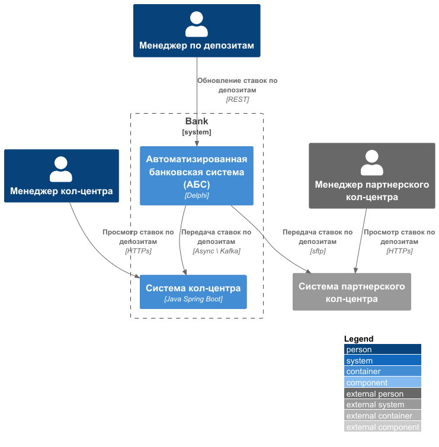
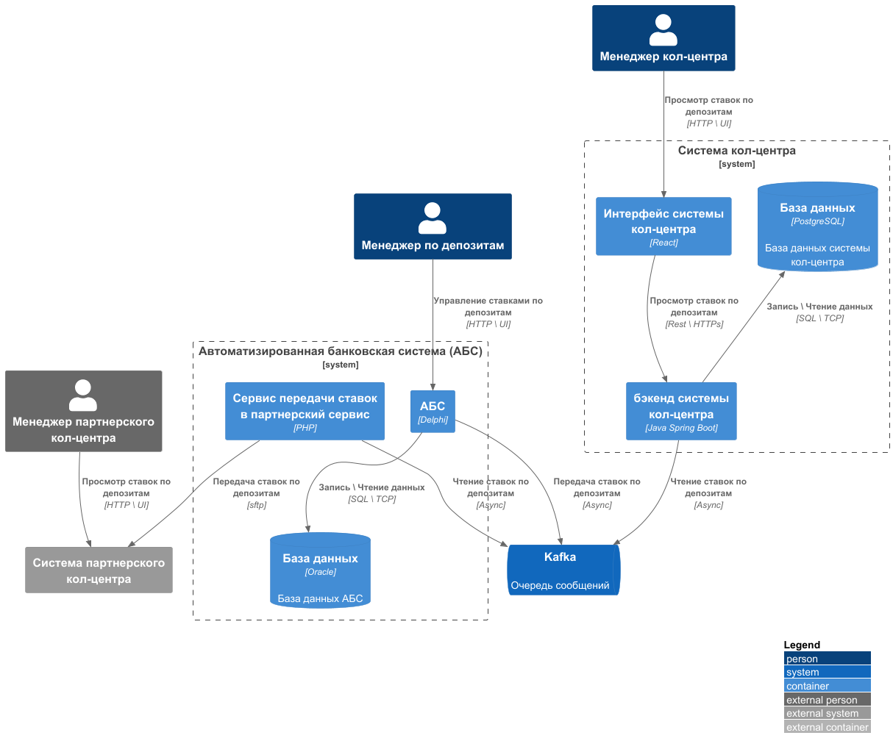

### **Название задачи: Передача ставок в call-центр**
### **Автор: Лебедев Андрей**
### **Дата: 30 марта 2025г.**
### **Функциональные требования**
| **№** | **Действующие лица или системы**               | **Use Case** | **Описание**                                                                                                                               |
|:-----:|:-----------------------------------------------|:-------------|:-------------------------------------------------------------------------------------------------------------------------------------------|
|  UC1  | Менеджер бэк-офиса, менеджер кол-центр, АБС    | Передача ставок в call-центр   | Менеджер обновляет ставки по депозитам, АБС обновляе ставки в БД, отправляет запрос на обновление ставок в системе кол-центра              |
|  UC2  | Менеджер бэк-офиса, партнерский кол-центр, АБС | Передача ставок в call-центр   | Менеджер обновляет ставки по депозитам, АБС обновляе ставки в БД, отправляет запрос на обновление ставок в системе партнреского кол-центра |

### **Нефункциональные требования**
Опишите здесь нефункциональные требования и архитектурно-значимые требования.

| **№** | **Требование**                                                                                                        |
|:-----:|:----------------------------------------------------------------------------------------------------------------------|
|   R   | Надежность                                                                                                            |
|  R1   | Все сервисы должны работать 24/7 и быть доступны в 99,9%                                                              |
|  R2   | переключение на резервный ЦОД в случае сбоя в основном                                                                |
|   P   | Производительность (Performance)                                                                                      |
|  P1   | Время обновления ставок в дочерних системах не должно превышать 3 минут                                               |
|   S   | Поддерживаемость                                                                                                      |
|  S1   | Требуется разработка документации                                                                                     | 
|  S2   | Переход на микросервисную архитектуру                                                                                 | 
|  S3   | При доработках во всех системах нужно как можно больше использовать технологии, которые уже есть в банке              | 
|  +R   | Ограничения                                                                                                           |
|  +R1  | новые технологии должны быть совместимы с существующими платформами разработки                                        |
|  +R2  | АБС может масштабироваться только вертикально из-за своей базы данных                                                 |
|  +R3  | предусмотреть равномерное горизонтальное масштабирование и распределение запросов между серверами, приложениями и ЦОД |
|  +R4  | избежать прямой работы интернет-банка с API АБС в новом процессе                                                      |
|  +R5  | в качестве брокера сообщений лучше использовать Kafka                                                                 |
|  +R6  | Данные необходимо защищать с помощью механизма шифрования                                                             | 
|  +R7  | Разработка функционала работы с смс силами команды разработки банка                                                   |

### **Решение**
**Диаграмма контекста**

Внедряемый функционал разрабатывается на микросервисной архитектуре с внедрением асинхронного межсервисного взаимодействия.
За счет внедрения очередей сообщений, достигаем:
1. R4 - исключение прямой работы интернет-банка с API АБС
2. R5 - в качестве брокера сообщений использован Kafka
3. R3 - за счет внедрения микросервисной архитектуры и очереди сообщение

[Диаграмма контекста](context.puml)

**Диаграмма контейнеров**
[Диаграмма контейнеров](container.puml)

### **Альтернативы**
В качестве альтернативного решение можно рассмотреть:
1. использование внешнего S3 хранилища
2. Аналогичные каналы передачи файл со ставками в партнерский сервис

**Недостатки, ограничения, риски**

Недостатки:
1. Требуется разработка компонентов системы для асинхронного взаимодействия
2. Передача файла со ставками по протоколу sftp является узким местом, за счет возможных ошибок при передаче по каналам связи и на стороне сервера партнеров

Основные риски:
1. Протокол sftp является узким местом, за счет возможных ошибок при передаче по каналам связи и на стороне сервера партнеров
2. Kafka как единая точка отказа

